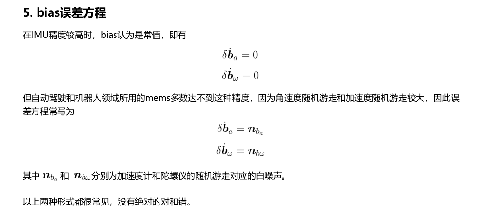
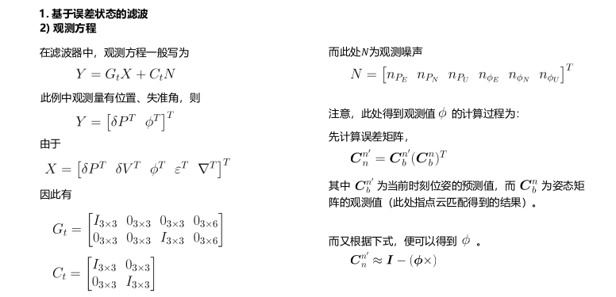
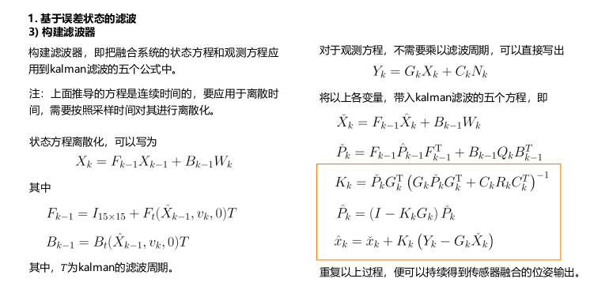

## 卡尔曼滤波

滤波器的本质：结合预测与观测，得到**精确**的后验。

观测一般来自于IMU、编码器等传感器递推出来，观测往往来自于GPS、雷达、相机等传感器。

### 全概率与贝叶斯

$$
p(x,y) = p(x|y)p(y) = p(y|x)p(x)\\
p(x|y) = p(y|x)p(x)/p(y)
$$
对公式的理解：

目前我们已经知道了$p(y|x)$即x发生条件下y发生的概率，以及p(x)与p(y)这样就可以得到p(x|y)。

$p(y|x)$ 似然，p(x)先验，p(x|y)后验。

x作为状态量，y作为观测。

### 状态估计模型

$$
p(x_k|x^\vee_0,v_{1:k},y_{0:k})
$$

$x^\vee_0$ 表示的是状态初始值

$v_{1:k}$ 表示从1到k时刻的输入

$y_{0:k}$表示从0到k时刻的观测

因此，滤波问题可以表示为，根据所有的历时数据（输入、观测、初始状态），得到最终融合结果。

运动方程：
$$
x_k = f(x_{k-1},v_k,w_k)
$$
观测方程：
$$
y_k = g(x_k,n_k)
$$

## 贝叶斯滤波

### KF

在线性高斯假设下，
$$
运动方程：x_k = F(x_{k-1},v_k) + B_{k-1}w_k\\
观测方程：y_k = G(x_k) + C_kn_k
$$
当前时刻的预测值为：

 

利用上一时刻的后验推理当前时刻的先验，同时计算出方差。

### EKF

## 基于误差状态的滤波

### IMU惯性解算

惯性导航解算就是从上一时刻的导航信息推导本时刻的导航信息，包括姿态、速度、位置。

运动输入 **(角速度、加速度)** 之间的关系，确切地说，是微分关系。姿态、速度、位置的更新中，尤以姿态更新的方法最多，计算也最为复杂，

因为姿态有不同的表示形式，而且具有非线性和不可交换性，因此它是整个导航解算的重中之重。

在低精度惯性导航中，以当地平面坐标系作为导航系，不考虑地球模型和地球自转角速度，这种做法当然也仅适用于低精度导航。**具体可分为以下两步：一是利用陀螺仪测得的载体相对于惯性坐标系的旋转角速度，计算得到载体坐标系至导航坐标系的转换矩阵；二是将加速度计测得的载体相对于惯性空间的加速度转换到导航坐标系，并从中补偿掉重力和Coriolis加速度，经积分得到所需要的导航定位信息。**

在实际导航模型中，不动系(i系)是地心惯性系，而我们要的导航结果是相对于导航系(n系)的，这两个坐标系之间有相对旋转，他们之间的旋转角速度可以表示为:
$$
w^n_{in} = w^n_{ie} + w^n_{en}
$$
$w^n_{ie}$ 表示地球自转引起的角速度；

$w^n_{en}$ 表示载体在地球表面运动时，地球旋转形成的角速度。
$$
w^n_{ie} = [0,w_{ie}cosL,w_{ie}sinL]^T\\
w^n_{en} = [-\frac{v_N}{R_M+h},\frac{v_E}{R_N+h},\frac{v_E}{R_N+h}\tan L]^T
$$

**https://zhuanlan.zhihu.com/p/131342530**

旋转矩阵微分方程：

四元数微分方程

姿态更新：

陀螺仪测量 $w_{ib}$ ，但是实际需要的是n系下，所以经过改变：

### IMU误差分析

https://blog.csdn.net/yongniao9185/article/details/114876477

误差分析为下一步的状态融合作准备。

误差方程：状态量(速度误差、位置误差、姿态误差、bias误差等)误差形式的表示。

误差方程的推导有固定的套路：

1、写出不考虑误差时的微分方程
$$
\dot z = x + y
$$
 2、写出考虑误差时的微分方程
$$
\dot {\tilde{z}} = \tilde{x} + \tilde{y}
$$
3、写出真实值与理想值之间的关系
$$
\tilde{z} = z + \delta z\\
\tilde{x} = x + \delta x\\
\tilde{y} = y + \delta y
$$
4、把3中的关系带入2
$$
\dot z + \delta {\dot z} = x + \delta x + y + \delta y
$$
5、把1中的关系，带入4
$$
x + y + \delta {\dot z} = x + \delta x + y +\delta y
$$
6、化简方程
$$
\delta {\dot z} = \delta x + \delta y
$$
姿态误差方程：

1、写出不考虑误差的微分方程
$$
\dot {q_t} = \frac{1}{2}q_t \bigotimes 
\begin{bmatrix}
0\\
w_t - b_{wt}
\end{bmatrix}
$$
其中$b_{wt}$为gyro的bias。
2、写出考虑误差时的微分方程
$$
\dot {\tilde{q_t}} = \frac {1}{2}\tilde{q_t} \bigotimes
\begin{bmatrix}
0\\
\tilde{w_t} - \tilde{b_{wt}}
\end{bmatrix}
$$
3、写出带误差的值与理想值之间的关系
$$
\tilde{q_t} = q_t \bigotimes \delta q\\
\tilde{w_t} = w_t + n_w\\
\tilde{b_{wt}} = b_{wt} + \delta b_w
$$
其中$n_w$ 为陀螺仪白噪声。
$$
\delta q = \begin{bmatrix}
\cos(\frac{|\delta \theta|}{2})\\
\frac{\delta \theta}{|\delta \theta|}\sin(\frac{\delta \theta}{2})
\end{bmatrix} \approx 
\begin{bmatrix}
1\\
\frac{\delta \theta}{2}
\end{bmatrix}
$$
$\delta \theta$ 是姿态误差对应的旋转矢量(有时被称为失准角)。

4、将3中的关系带入2
$$
\dot {(q_t \bigotimes \delta q)} = \frac{1}{2}q_t \bigotimes \delta q \bigotimes \begin{bmatrix}
0\\
w_t + n_w + b_{wt} + \delta b_w
\end{bmatrix}
$$
5、把1中的关系带入4
$$
\dot {(q_t \bigotimes \delta q)} \\
= \dot {q_t} \bigotimes \delta q + q_t \bigotimes \delta {\dot q} \\
= \frac{1}{2}q_t \bigotimes \begin{bmatrix}
0\\
w_t - b_{wt}
\end{bmatrix} \bigotimes \delta q + q_t \bigotimes \delta {\dot q}\\
= \frac{1}{2}q_t \bigotimes \delta q \bigotimes \begin{bmatrix}
0\\
w_t + n_w - b_{wt} - \delta b_w
\end{bmatrix}
$$

6、化简方程

首先把5中最后两行左乘$(q_t)^{-1}$并移项可得：
$$
\delta {\dot q} = \frac{1}{2}\delta q \bigotimes \begin{bmatrix}
0\\
w_t + n_w - b_{wt} -\delta{b_w}
\end{bmatrix} - \frac{1}{2}\begin{bmatrix}
0\\
w_t - b_{wt}
\end{bmatrix} \bigotimes \delta q
$$

速度误差方程：

位置误差方程：

bias 误差方程：

### 基于滤波的融合

1、状态方程
$$
\dot \phi = \phi \times w^n_{ie} - \delta{w^n_{ib}}\\
\delta {\dot V} = f^n \times \phi + \delta{f^n}\\
\delta{\dot P} = \delta V
$$
将其中元素展开：
$$
\phi = \begin{bmatrix}
\phi_E & \phi_N & \phi_U
\end{bmatrix}^T\\
w^n_{ie} = \begin{bmatrix}
0 & w\cos L & w\sin L
\end{bmatrix}^T
$$
w为地球自转角速度。
$$
\delta {w^n_{ib}} = C^n_b \begin{bmatrix}
\epsilon_x \\
\epsilon_y \\
\epsilon_z
\end{bmatrix}
$$
$\epsilon$为陀螺仪的bias

因此$\dot \phi = \phi \times w^n_{ie} - \delta{w^n_{ib}}$ 展开为：
$$
\begin{bmatrix}
\dot \phi_E \\
\dot \phi_N \\
\dot \phi_U 
\end{bmatrix} = 
\begin{bmatrix}
0 & -\phi_U & \phi_N \\
\phi_U & 0 & -\phi_E \\
-\phi_N & \phi_E & 0
\end{bmatrix}
\begin{bmatrix}
0\\
w\cos L\\
w\sin L
\end{bmatrix} -
C^n_b \begin{bmatrix}
\epsilon_x \\
\epsilon_y \\
\epsilon_z
\end{bmatrix}
$$

$$
f^n = \begin{bmatrix}
f_E & f_N & f_U
\end{bmatrix}^T
$$

$$
\delta {f^n} = C^n_b \begin{bmatrix}
\nabla_x \\
\nabla_y \\
\nabla_z
\end{bmatrix}
$$

$\nabla$为基速度计bias

$\delta {\dot V} = f^n \times \phi + \delta{f^n}$展开为
$$
\begin{bmatrix}
\delta \dot V_E \\
\delta \dot V_N \\
\delta \dot V_U 
\end{bmatrix} = 
\begin{bmatrix}
0 & -f_U & f_N \\
f_U & 0 & -f_E \\
-f_N & f_E & 0
\end{bmatrix}
\begin{bmatrix}
\phi_E\\
\phi_N\\
\phi_U
\end{bmatrix} +
C^n_b \begin{bmatrix}
\nabla_x \\
\nabla_y \\
\nabla_z
\end{bmatrix}
$$

$$
\begin{bmatrix}
\delta \dot P_E \\
\delta \dot P_N \\
\delta \dot P_U 
\end{bmatrix} = 
\begin{bmatrix}
\delta V_E \\
\delta V_N \\
\delta V_U
\end{bmatrix}
$$

**使用四元数推导**

